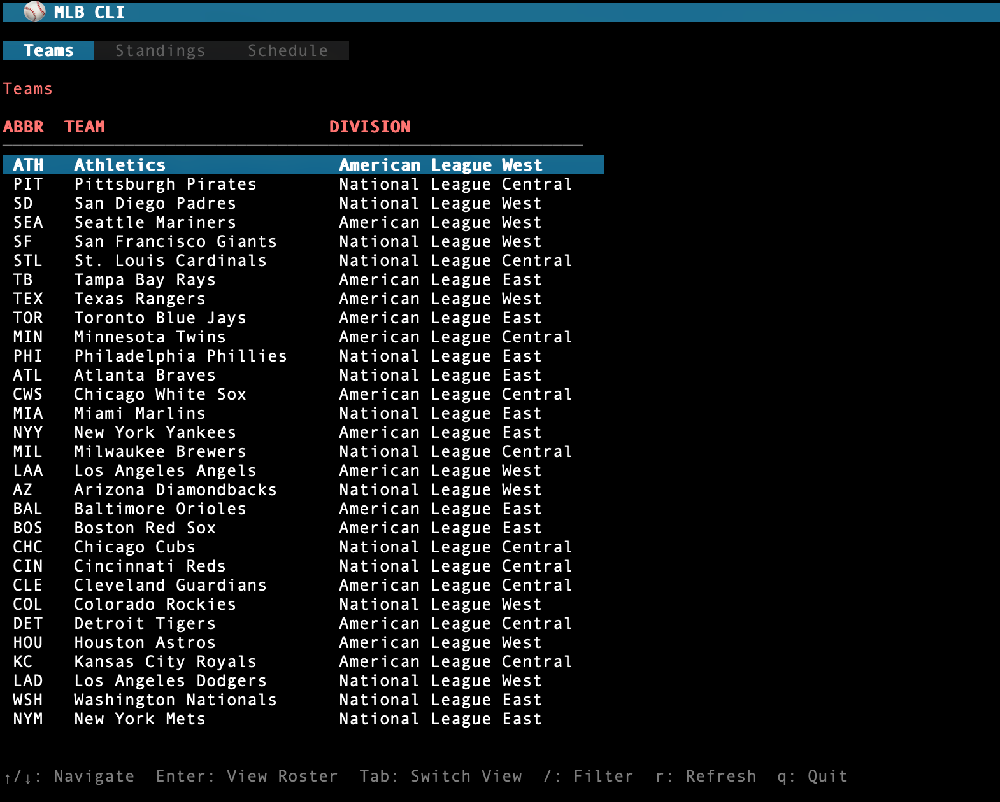
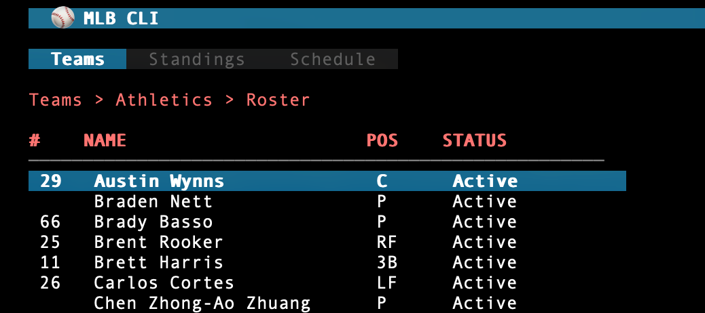
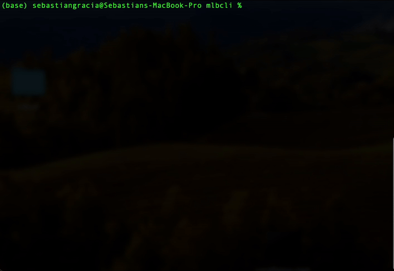

# MLB CLI

A command-line interface for accessing MLB statistics and information, inspired by `kubectl` and `k9s`.

## Screenshots



<br>



<br>


<br>



## Features

- **Interactive TUI Mode** - Full-screen terminal UI like k9s for browsing teams, rosters, standings, and schedules
- **CLI Mode** - Traditional command-line interface like kubectl for scripting and quick lookups
- **Multiple Output Formats** - Table, wide, and JSON output formats
- **Team Abbreviations** - Use LAD instead of team ID 119
- **Shell Completion** - Bash, Zsh, Fish, and PowerShell support

## Installation

### From Source

```bash
# Clone the repository
git clone https://github.com/yourusername/mlb-cli.git
cd mlb-cli

# Build
go build -o mlb .

# Optional: Move to PATH
sudo mv mlb /usr/local/bin/
```

### Build with Version Info

```bash
go build -ldflags "-X mlb-cli/cmd.Version=1.0.0 -X mlb-cli/cmd.GitCommit=$(git rev-parse HEAD) -X mlb-cli/cmd.BuildDate=$(date -u +%Y-%m-%dT%H:%M:%SZ)" -o mlb .
```

## Interactive TUI Mode

Launch the interactive terminal UI by running `mlb` without any arguments:

```bash
mlb
```

### TUI Keybindings

| Key | Action |
|-----|--------|
| `↑` / `k` | Move cursor up |
| `↓` / `j` | Move cursor down |
| `Enter` | Select / drill down |
| `Backspace` | Go back |
| `Tab` | Next tab (Teams → Standings → Schedule) |
| `Shift+Tab` | Previous tab |
| `/` | Filter/search |
| `r` | Refresh data |
| `q` / `Ctrl+C` | Quit |

### TUI Navigation

1. **Teams Tab** - Browse all MLB teams
   - Press `Enter` on a team to view their roster
   - Press `Enter` on a player to view their stats

2. **Standings Tab** - View division standings

3. **Schedule Tab** - View today's games and scores

## CLI Mode

For scripting and quick lookups, use commands directly:

```bash
mlb [command] [subcommand] [flags]
```

### Global Flags

| Flag | Short | Description |
|------|-------|-------------|
| `--output` | `-o` | Output format: `table`, `wide`, or `json` (default: `table`) |
| `--help` | `-h` | Help for any command |

## Commands

### Get Resources

List and display MLB resources.

```bash
# List all teams
mlb get teams
mlb g t                    # Using aliases

# View standings
mlb get standings
mlb get standings --season 2024
mlb get standings -s 2023

# View game schedule
mlb get schedule           # Today's games
mlb get schedule --date 2024-10-15
mlb get schedule -d 2024-07-04

# View team roster
mlb get roster --team LAD  # Using team abbreviation
mlb get roster -t NYY
mlb get roster -t 119      # Using team ID
```

### Describe Resources

Show detailed information about specific resources.

```bash
# Search for a player
mlb describe player "Shohei Ohtani"
mlb describe player ohtani
mlb d p "Mike Trout"       # Using aliases

# View player statistics
mlb describe stats 660271              # All career stats
mlb describe stats 660271 --season 2024
mlb describe stats 545361 -s 2023
```

### Output Formats

```bash
# Default table format
mlb get teams

# Wide format (more details)
mlb get teams -o wide

# JSON format
mlb get teams -o json
```

### Shell Completion

Generate autocompletion scripts for your shell:

```bash
# Bash
mlb completion bash > /etc/bash_completion.d/mlb

# Zsh
mlb completion zsh > "${fpath[1]}/_mlb"

# Fish
mlb completion fish > ~/.config/fish/completions/mlb.fish

# PowerShell
mlb completion powershell > mlb.ps1
```

## Team Abbreviations

Use these abbreviations with the `--team` flag:

| Abbr | Team | Abbr | Team |
|------|------|------|------|
| LAA | Los Angeles Angels | NYM | New York Mets |
| ARI | Arizona Diamondbacks | NYY | New York Yankees |
| ATL | Atlanta Braves | OAK | Oakland Athletics |
| BAL | Baltimore Orioles | PHI | Philadelphia Phillies |
| BOS | Boston Red Sox | PIT | Pittsburgh Pirates |
| CHC | Chicago Cubs | SD | San Diego Padres |
| CIN | Cincinnati Reds | SEA | Seattle Mariners |
| CLE | Cleveland Guardians | SF | San Francisco Giants |
| COL | Colorado Rockies | STL | St. Louis Cardinals |
| CWS | Chicago White Sox | TB | Tampa Bay Rays |
| DET | Detroit Tigers | TEX | Texas Rangers |
| HOU | Houston Astros | TOR | Toronto Blue Jays |
| KC | Kansas City Royals | WSH | Washington Nationals |
| LAD | Los Angeles Dodgers | MIA | Miami Marlins |
| MIL | Milwaukee Brewers | MIN | Minnesota Twins |

## Project Structure

```
mlb-cli/
├── main.go                 # Entry point
├── go.mod                  # Module definition
├── go.sum                  # Dependency checksums
├── cmd/
│   ├── root.go            # Root command and global flags
│   ├── version.go         # Version command
│   ├── get.go             # Get command group
│   └── describe.go        # Describe command group
└── internal/
    ├── api/
    │   └── client.go      # MLB API client
    ├── models/
    │   └── models.go      # Data types
    ├── output/
    │   └── formatter.go   # Output formatting
    └── tui/
        ├── tui.go         # TUI entry point
        ├── model.go       # Bubble Tea model
        ├── update.go      # Event handling
        ├── view.go        # UI rendering
        ├── keys.go        # Keybindings
        └── styles.go      # UI styles
```

## Examples

```bash
# Launch interactive TUI
mlb

# Get today's games in JSON format
mlb get schedule -o json

# Find a player and view their stats
mlb describe player "Aaron Judge"
# Output shows player ID: 592450
mlb describe stats 592450 --season 2024

# View Dodgers roster with extra details
mlb get roster -t LAD -o wide

# Check standings for 2023 season
mlb get standings -s 2023
```

## Dependencies

- [Cobra](https://github.com/spf13/cobra) - CLI framework
- [Bubble Tea](https://github.com/charmbracelet/bubbletea) - TUI framework
- [Lip Gloss](https://github.com/charmbracelet/lipgloss) - TUI styling
- [Bubbles](https://github.com/charmbracelet/bubbles) - TUI components

## API

This CLI uses the official [MLB Stats API](https://statsapi.mlb.com).

## License

MIT
